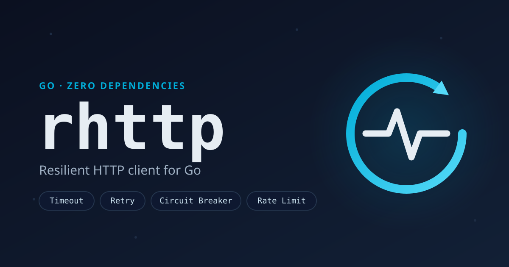

<p align="center">
  
</p>

# rhttp

Production-grade HTTP client for Go with built-in resiliency patterns.

[](https://github.com/oswaldom-code/rhttp/actions/workflows/ci.yml)
[](https://codecov.io/gh/oswaldom-code/rhttp)
[](https://goreportcard.com/report/github.com/oswaldom-code/rhttp)
[](https://pkg.go.dev/github.com/oswaldom-code/rhttp)
[](https://opensource.org/licenses/MIT)
[](https://go.dev/)

## Motivation

After building HTTP clients with resiliency patterns across multiple microservice
projects, a recurring pattern emerged:

1. **The stdlib is not enough** - `net/http` is powerful but ships no retry,
   circuit breaker, or rate limiting
2. **Dependencies are a liability** - Libraries like Resty pull in transitive
   dependencies that complicate security audits and grow the binary size
3. **Reinventing the wheel is costly** - Every team ends up writing its own
   wrapper with subtle bugs in context handling, timeouts, and connection pooling

This library solves that: **production-ready resiliency with zero dependencies**.

### Usage Modes

| Mode | When to use it |
|------|----------------|
| `go get` | Projects that accept external dependencies |
| Copy into `pkg/rhttp` | Strict zero-deps policies, vendor everything |

The code is designed to work in both scenarios without modification.

## Features

- **Zero dependencies** - Only Go standard library
- **Low overhead** - The full middleware stack adds ~1 μs per request
- **Middleware architecture** - Composable, testable, extensible
- **Fluent API** - Resty-style request builder
- **Resiliency patterns** - Retry, circuit breaker, rate limiting, timeout
- **Multiple backoff strategies** - Constant, linear, exponential, Fibonacci, jitter variants
- **Well tested** - Race-clean suite; live coverage in the Codecov badge above

## Installation

```bash
go get github.com/oswaldom-code/rhttp
```

Requires Go 1.21+

## Quick Start

### Basic Usage

```go
package main

import (
    "context"
    "fmt"
    "net/http"
    "time"

    "github.com/oswaldom-code/rhttp"
)

func main() {
    // Create client with middleware
    client := rhttp.New(
        rhttp.WithMiddleware(
            rhttp.Timeout(5*time.Second),
            rhttp.Retry(rhttp.RetryConfig{MaxAttempts: 3}),
            rhttp.CircuitBreaker(rhttp.CircuitBreakerConfig{
                FailureThreshold: 5,
                ResetTimeout:     30*time.Second,
            }),
        ),
    )

    // Make request
    req, _ := http.NewRequest("GET", "https://api.example.com/users", nil)
    resp, err := client.Do(context.Background(), req)
    if err != nil {
        panic(err)
    }
    defer resp.Body.Close()

    fmt.Println("Status:", resp.StatusCode)
}
```

### Fluent API

```go
client := rhttp.New()

// GET request with query params
resp, err := client.R().
    SetHeader("Authorization", "Bearer token").
    SetQueryParam("page", "1").
    SetQueryParam("limit", "10").
    Get("https://api.example.com/users")

// POST request with JSON body
resp, err := client.R().
    SetAuthToken("my-token").
    SetBodyJSON(map[string]string{
        "name":  "John",
        "email": "john@example.com",
    }).
    Post("https://api.example.com/users")

// Path parameters
resp, err := client.R().
    SetPathParam("org", "acme").
    SetPathParam("repo", "api").
    Get("https://api.github.com/repos/{org}/{repo}")

// Decode a JSON response (closes the body, fails on status >= 300)
var user User
resp, err := client.R().Get("https://api.example.com/users/1")
if err == nil {
    err = rhttp.DecodeJSON(resp, &user)
}
```

## Middleware

### Timeout

```go
client := rhttp.New(
    rhttp.WithMiddleware(
        rhttp.Timeout(5*time.Second),
    ),
)
```

Respects existing context deadlines - uses the shorter of the two.

### Retry

```go
client := rhttp.New(
    rhttp.WithMiddleware(
        rhttp.Retry(rhttp.RetryConfig{
            MaxAttempts:     3,
            Backoff:         rhttp.ExponentialBackoff(100*time.Millisecond, 10*time.Second),
            IsRetryable:     rhttp.DefaultIsRetryable, // 429, 502, 503, 504
            RetryAllMethods: false, // Only retry idempotent methods by default
        }),
    ),
)
```

**Built-in backoff strategies:**

| Strategy | Description |
|----------|-------------|
| `ConstantBackoff(d)` | Always wait `d` |
| `LinearBackoff(base, max)` | `base * (attempt + 1)` |
| `ExponentialBackoff(base, max)` | `base * 2^attempt` with ±20% jitter |
| `FibonacciBackoff(base, max)` | `base * fib(attempt)` |
| `ExponentialBackoffFullJitter(base, max)` | `random(0, base * 2^attempt)` |
| `ExponentialBackoffEqualJitter(base, max)` | `base * 2^attempt / 2 + random(0, half)` |
| `DecorrelatedJitterBackoff(base, max)` | AWS-style decorrelated jitter |

Composable with `WithJitter()`, `WithMin()`, `WithMax()`, and `WithRetryAfter()`
(honors the `Retry-After` header on 429/503 responses).

### Circuit Breaker

```go
client := rhttp.New(
    rhttp.WithMiddleware(
        rhttp.CircuitBreaker(rhttp.CircuitBreakerConfig{
            FailureThreshold: 5,           // Open after 5 consecutive failures
            ResetTimeout:     30*time.Second, // Try half-open after 30s
            IsFailure:        rhttp.DefaultIsFailure, // Errors + 5xx
        }),
    ),
)
```

State machine: `Closed → Open → Half-Open → Closed/Open`

Returns `rhttp.ErrCircuitOpen` when circuit is open.

**Observing transitions.** Use `OnStateChange`, not a poll:

```go
rhttp.CircuitBreaker(rhttp.CircuitBreakerConfig{
    FailureThreshold: 5,
    ResetTimeout:     30 * time.Second,
    OnStateChange: func(from, to rhttp.CircuitState) {
        log.Printf("circuit %s -> %s", from, to)
    },
})
```

At the default `SuccessThreshold` of 1, the half-open phase is entered and left
inside a single `RoundTrip`, so **no polling frequency can sample it** — a poller
sees `closed → open → closed` and the recovery mechanism is invisible. The
callback reports rather than samples, so a transition lasting nanoseconds still
shows up. It runs with the breaker's mutex released, on the goroutine of the
request that caused the transition, so reading `State()` from inside it is safe;
it must not block, because the request cannot proceed until it returns.

When you need a handle to the breaker itself, use `CircuitBreakerWithState` (or
`NewCircuitBreaker(...).Middleware()` to share one circuit across clients):

```go
mw, breaker := rhttp.CircuitBreakerWithState(cfg)
client := rhttp.New(rhttp.WithMiddleware(mw))
_ = breaker.State()
```

### Rate Limiting

```go
// Token bucket: 100 requests/second, burst of 10
limiter := rhttp.NewTokenBucket(100, 10)

client := rhttp.New(
    rhttp.WithMiddleware(
        rhttp.RateLimit(rhttp.RateLimitConfig{
            Limiter:           limiter,
            WaitOnLimit:       true,  // Block until token available
            RespectRetryAfter: true,  // Honor Retry-After header
        }),
    ),
)
```

A non-positive rate or a burst below 1 cannot produce a limiter, so
`NewTokenBucket` falls back to not limiting. When the values come from
configuration, use `NewTokenBucketE` and fail at startup instead:

```go
limiter, err := rhttp.NewTokenBucketE(cfg.Rate, cfg.Burst)
if err != nil {
    return err // errors.Is(err, rhttp.ErrInvalidRateLimit)
}
```

### Invalid configuration

`Timeout(0)`, `RateLimit{Limiter: nil}` and `NewTokenBucket(0, …)` fall back to a
pass-through rather than busy-looping or blocking forever. The fallback is safe,
but a protection that is silently absent gets discovered during the incident it
was meant to prevent — so set `OnInvalidConfig` at startup and find out at deploy
time instead:

```go
func init() {
    rhttp.OnInvalidConfig = func(component, reason string) {
        log.Printf("rhttp: %s is inert: %s", component, reason)
    }
}
```

Nil by default. `Metrics{Recorder: nil}` and `Logging{Logger: nil}` stay silent by
design: there the zero value means "observability not configured", which is a
legitimate default and loses no protection.

### Logging

```go
client := rhttp.New(
    rhttp.WithMiddleware(
        rhttp.Logging(rhttp.LoggingConfig{
            Logger: rhttp.LoggerFunc(func(e rhttp.LogEntry) {
                log.Printf("%s %s %d %v", e.Method, e.URL, e.StatusCode, e.Duration)
            }),
            ShouldLog: func(req *http.Request, resp *http.Response, err error) bool {
                return err != nil || resp.StatusCode >= 500 // Only log errors
            },
        }),
    ),
)
```

### Metrics

```go
client := rhttp.New(
    rhttp.WithMiddleware(
        rhttp.Metrics(rhttp.MetricsConfig{
            Recorder: rhttp.MetricsRecorderFunc(func(e rhttp.MetricEvent) {
                // Send to Prometheus, StatsD, etc.
                myCounter.WithLabels(e.Method, e.Host, e.StatusCode).Inc()
                myHistogram.Observe(e.Duration.Seconds())
            }),
        }),
    ),
)
```

`MetricEvent` fields: `Method`, `Host`, `Path`, `StatusCode`, `Duration`, `BytesSent`, `BytesReceived`, `Error`, `Success`

#### Path cardinality

Exporting a raw request path (`/users/8f3a.../orders/2941`) as a metrics label creates one time series per ID, which grows Prometheus memory without bound. To prevent this, `Path` is **empty by default** and is only populated when you provide a `PathNormalizer` that collapses high-cardinality segments to a template:

```go
rhttp.Metrics(rhttp.MetricsConfig{
    Recorder: recorder,
    PathNormalizer: func(p string) string {
        // /users/8f3a/orders/2941 -> /users/:id/orders/:id
        return idSegment.ReplaceAllString(p, "/:id")
    },
})
```

To emit the raw path anyway (not recommended as a metrics label), use `func(p string) string { return p }`.

## Error Classification

```go
resp, err := client.Do(ctx, req)
if err != nil {
    classified := rhttp.Classify(err)

    switch classified.Kind {
    case rhttp.ErrKindTimeout:
        // Request timed out
    case rhttp.ErrKindCanceled:
        // Context was canceled
    case rhttp.ErrKindConnection:
        // Connection refused, reset, etc.
    case rhttp.ErrKindDNS:
        // DNS resolution failed, transiently
    case rhttp.ErrKindDNSNotFound:
        // NXDOMAIN: the name does not exist. Permanent, never retried
    case rhttp.ErrKindTLS:
        // Certificate error
    case rhttp.ErrKindCircuitOpen:
        // The client's own breaker refused the call: never reached the network
    case rhttp.ErrKindRateLimited:
        // The client's own quota refused the call: never reached the network
    }

    // Or use helpers
    if rhttp.IsRetryable(err) {
        // Safe to retry (timeout, connection, transient DNS)
    }
}
```

`ErrKindCircuitOpen` and `ErrKindRateLimited` name the two outcomes the client
produces itself. They matter most where classification is wired into metrics: a
breaker engaging is the most informative signal the stack emits — the moment the
protection kicked in — and it must not share a bucket with "a failure this
library could not identify". Neither is retryable: retrying inside the same
operation would defeat the protection that produced the error.

`ErrKindDNS` and `ErrKindDNSNotFound` are split because they call for opposite
handling: a SERVFAIL may clear on the next lookup, while an NXDOMAIN cannot —
retrying it only spends the attempt budget and the full backoff schedule on an
outcome that is already decided. `IsDNS` matches both; `IsDNSNotFound` singles
out the permanent one.

## Middleware Order

The **first middleware in the list is the outermost**: it runs first on the way in and last on the way out. Each subsequent middleware wraps the ones after it, and the transport sits at the center.

```go
client := rhttp.New(
    rhttp.WithMiddleware(
        rhttp.Logging(...),        // 1. Log request start
        rhttp.Metrics(...),        // 2. Start timing
        rhttp.Timeout(...),        // 3. Apply timeout
        rhttp.RateLimit(...),      // 4. Check rate limit
        rhttp.Retry(...),          // 5. Retry on failure
        rhttp.CircuitBreaker(...), // 6. Check circuit per attempt
    ),
)
```

Recommended order: `Logging → Metrics → Timeout → RateLimit → Retry → CircuitBreaker`

### Timeout placement changes its meaning

Where you put `Timeout` relative to `Retry` selects one of two semantics — both valid, but very different:

| Pattern | Order | Meaning |
|---------|-------|---------|
| **Total budget** | `Timeout → Retry` | The timeout covers **all attempts and their backoffs combined**. Once it expires, no further retries happen. |
| **Per-attempt timeout** | `Retry → Timeout` | Each attempt gets its **own fresh timeout**; the total wall-clock time is roughly `attempts × timeout` plus backoffs. |

See the runnable `ExampleRetry_totalBudget` and `ExampleRetry_perAttemptTimeout` for both wirings.

`RetryConfig.AttemptTimeout` expresses the per-attempt semantics without
depending on the order:

```go
rhttp.Retry(rhttp.RetryConfig{
    MaxAttempts:    3,
    AttemptTimeout: 2 * time.Second, // each attempt, wherever Timeout sits
})
```

This matters because **a deadline on the caller's context bounds the operation,
not each attempt**. Against a dependency that has become slow rather than one
that fails fast, the first attempt can consume the whole deadline and no retry
happens at all — `MaxAttempts: 3` yields one request on the wire, and the error,
the log and the metric all report a plain timeout. Set `AttemptTimeout`, or place
`Timeout` immediately beneath `Retry` and verify it with a counting middleware
below both; there is no other way to tell the two configurations apart.

### Retry vs CircuitBreaker

| Order | Effect |
|-------|--------|
| `Retry → CircuitBreaker` (retry outer) **— recommended** | Each attempt consults the circuit; a tripped breaker short-circuits the remaining attempts. The circuit counts every attempt. |
| `CircuitBreaker → Retry` (breaker outer) | The circuit sees one fully-retried request as a single call; retries are not individually gated by the breaker. |

## Custom Transport

```go
// Use custom transport
client := rhttp.New(
    rhttp.WithTransport(&http.Transport{
        MaxIdleConns:        200,
        MaxIdleConnsPerHost: 20,
        IdleConnTimeout:     90*time.Second,
    }),
)

// Or use optimized default
transport := rhttp.DefaultTransport() // HTTP/2 enabled, optimized pool
```

## Benchmarks

Two suites, measured 2026-08-05 on linux/amd64 (Intel Core i7-1255U, Go 1.24.1):
the in-repo microbenchmarks (`make bench`) measure client and middleware
overhead against a no-op transport, and a standalone comparison harness
([`benchmarks/`](benchmarks/), `make report`) measures rhttp against Resty
v2.17.2, go-retryablehttp v0.7.8 and Heimdall v7.0.3 with equivalent
configuration (5s timeout, 3 attempts, exponential backoff 100ms-2s).

### Middleware overhead (no network)

Minimum of 5 runs:

```
BenchmarkMiddlewareOverhead_Baseline-12            240 ns/op    656 B/op    4 allocs/op
BenchmarkMiddlewareOverhead_WithRetry-12           272 ns/op    656 B/op    4 allocs/op
BenchmarkMiddlewareOverhead_WithCircuitBreaker-12  266 ns/op    656 B/op    4 allocs/op
BenchmarkMiddlewareOverhead_AllMiddleware-12      1008 ns/op   1304 B/op   11 allocs/op
BenchmarkStdHttpClient_Baseline-12                 256 ns/op    552 B/op    5 allocs/op
BenchmarkTokenBucket_TryAcquire-12                  48 ns/op      0 B/op    0 allocs/op
BenchmarkBackoffStrategies/Exponential-12            8 ns/op      0 B/op    0 allocs/op
```

- Full middleware stack: ~1 μs and ~1.5 KB per request — negligible against network latency (0.5–500 ms)
- Rate limiter: 48 ns per check, zero allocations
- Backoff strategies: <10 ns, zero allocations

### Comparison with other clients

Wrapper overhead (no-op transport, timeout + 3-attempt retry configured everywhere, min of 5 runs):

| Client | ns/op | allocs/op | vs best |
|---|---:|---:|---:|
| rhttp (Timeout+Retry) | 784 | 10 | 1.00x |
| rhttp (Timeout+Retry+CircuitBreaker) | 785 | 10 | 1.00x |
| net/http (Timeout only, no retry) | 1672 | 26 | 2.13x |
| go-retryablehttp | 1719 | 26 | 2.19x |
| Heimdall (retry) | 2579 | 32 | 3.29x |
| Resty (retry) | 5803 | 48 | 7.40x |

End-to-end (~1 KB JSON over loopback):

| Client | ns/op | allocs/op | vs best |
|---|---:|---:|---:|
| go-retryablehttp | 60326 | 74 | 1.00x |
| net/http (Timeout only, no retry) | 61578 | 75 | 1.02x |
| Heimdall (retry) | 64415 | 80 | 1.07x |
| rhttp (Timeout+Retry+CircuitBreaker) | 64939 | 74 | 1.08x |
| rhttp (Timeout+Retry) | 66714 | 74 | 1.11x |
| Resty (retry) | 73722 | 96 | 1.22x |

**Read the caveats before quoting these numbers:**

- All clients are configured equivalently and fully consume and close each response body.
- `net/http` does not retry: it is the floor, not a symmetric competitor.
- Heimdall runs without its Hystrix circuit breaker (retry only, for feature symmetry).
- Resty buffers the full response body by design.
- Loopback amplifies relative overhead: against a real network (0.5-500 ms per
  request) every client in the table performs the same for practical purposes.

Full methodology and reproduction steps: [`benchmarks/REPORT.md`](benchmarks/REPORT.md).

## Design Principles

1. **No global state** - Each client is independent
2. **Context-first** - All operations respect context cancellation
3. **Fail fast** - Explicit errors, no silent failures
4. **Composable** - Mix and match middleware
5. **Testable** - All components are mockable
6. **Zero dependencies** - Only Go standard library

## API Reference

See [pkg.go.dev](https://pkg.go.dev/github.com/oswaldom-code/rhttp) for full API documentation.

## Development

### Prerequisites

```bash
# Install development tools
make install-tools
```

### Available Commands

```bash
make help          # Show all available commands
make test          # Run unit tests
make test-race     # Run tests with race detector
make test-coverage # Generate coverage report
make bench         # Run benchmarks
make lint          # Run golangci-lint
make fmt           # Format code
make vet           # Run go vet
make check         # Run all checks (fmt, vet, lint, test)
make docs          # Serve documentation locally
make clean         # Clean build artifacts
```

### CI Pipeline

The project uses GitHub Actions for CI with:

- Tests on Go 1.21, 1.22, and 1.23
- Race detector enabled
- golangci-lint for code quality
- Coverage reporting
- Benchmark tracking on PRs

## Contributing

Contributions are welcome! Please ensure:

1. Fork the repository
2. Create a feature branch: `git checkout -b feature/my-feature`
3. Run checks: `make check`
4. Commit changes: `git commit -m 'Add my feature'`
5. Push: `git push origin feature/my-feature`
6. Open a Pull Request

All PRs must pass CI checks before merging.

## Roadmap

> **Status:** v0.2.0 released (Phase 1 complete). Phase 2 is the next focus.

### Phase 1: Foundation (Completed)

- [x] **Middleware architecture** - Composable, chained `http.RoundTripper`
- [x] **Functional options** - Configuration via `WithXxx()`
- [x] **Optimized transport** - HTTP/2, tuned connection pooling and timeouts
- [x] **Timeout middleware** - Context-aware, respects shorter deadlines
- [x] **Retry middleware** - Idempotency-safe with body replay
- [x] **Backoff strategies** - Constant, linear, exponential, Fibonacci, jitter variants
- [x] **Retry-After support** - `WithRetryAfter` honors the header on 429/503
- [x] **Circuit breaker** - Closed/Open/Half-Open state machine, single-probe half-open
- [x] **Shared circuit breaker** - One circuit state across multiple clients
- [x] **Rate limiting** - Token bucket behind the pluggable RateLimiter interface
- [x] **Logging middleware** - Pluggable `Logger` interface
- [x] **Metrics middleware** - Pluggable `MetricsRecorder` interface
- [x] **Error classification** - Timeout, connection, DNS, TLS, temporary
- [x] **Fluent API** - Resty-style `RequestBuilder` plus the `DecodeJSON` helper
- [x] **Zero dependencies** - Only Go standard library

### Phase 2: Advanced Resiliency

- [ ] **Circuit breaker per endpoint** - Separate circuit state for each host/path
- [ ] **Sliding window statistics** - Time-based failure rate calculation
- [ ] **Bulkhead pattern** - Resource isolation per service
- [ ] **Retry budget** - Limit retries per time window
- [ ] **Hedged requests** - Send duplicate request if first is slow
- [ ] **Adaptive timeout** - Adjust timeout based on latency percentiles

### Phase 3: Observability

- [ ] **OpenTelemetry integration** - Native tracing and metrics
- [ ] **slog compatibility** - Structured logging (Go 1.21+)
- [ ] **Prometheus metrics** - Out-of-the-box histograms and counters
- [ ] **Distributed tracing** - Automatic trace context propagation
- [ ] **Health check endpoints** - Readiness/liveness probes

### Phase 4: Developer Experience

- [ ] **Auto marshaling** - JSON, XML, Protocol Buffers, MessagePack
- [ ] **OAuth2 support** - Automatic token refresh
- [ ] **Debug mode** - Request/response dump, curl generation
- [ ] **Response validation** - JSON Schema, status assertions
- [ ] **Multipart uploads** - With progress callbacks

### Phase 5: Advanced Features

- [ ] **Load balancing** - Round-robin, weighted, least connections
- [ ] **Service discovery** - DNS SRV, Kubernetes, Consul
- [ ] **Response caching** - RFC 7234 compliant, pluggable backends
- [ ] **Request coalescing** - Single-flight for duplicate requests
- [ ] **HTTP/3 support** - QUIC protocol (optional)
- [ ] **Connection warm-up** - Pre-establish connections

### Phase 6: Enterprise

- [ ] **mTLS support** - Mutual TLS authentication
- [ ] **Certificate pinning** - Enhanced security
- [ ] **Secrets management** - Vault integration
- [ ] **Configuration hot-reload** - Runtime tuning
- [ ] **Chaos engineering** - Fault injection for testing

---

Want to contribute? Check the issues labeled `good first issue` or `help wanted`.

## License

MIT License - see [LICENSE](LICENSE) file.
