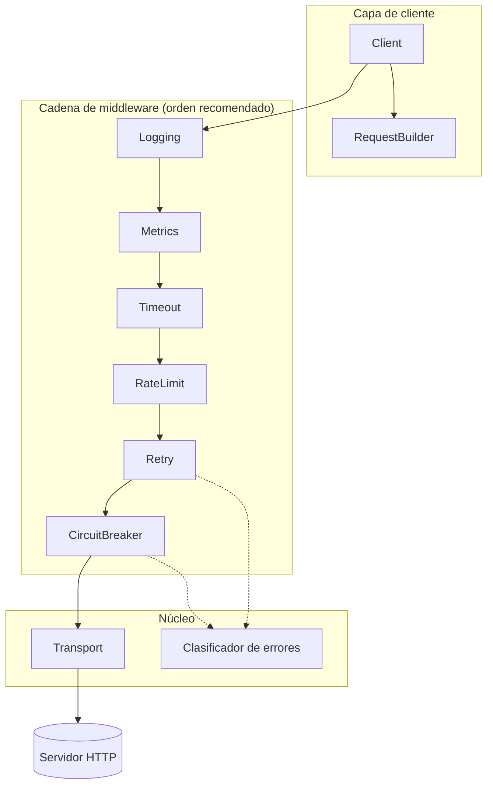

# Arquitectura

rhttp es una capa fina de composición sobre `net/http`: cada capacidad es un
decorador de `http.RoundTripper`, y el cliente es la composición funcional del
middleware que elijas.

## Decisiones clave

**Middleware antes que configuración.** En vez de un cliente monolítico con
banderas de funcionalidad, cada preocupación es una
`func(http.RoundTripper) http.RoundTripper` independiente. Pagas solo por lo que
compones, y cualquier cosa que implemente la interfaz estándar —incluido tu
propio middleware— encaja en la cadena.

**Retry por fuera del breaker.** Cada intento de reintento consulta el circuito.
Cuando el breaker se abre a mitad de la secuencia, `ErrCircuitOpen` (no
reintentable) corta los intentos restantes en lugar de encolar sondas inútiles
contra un host muerto.

**La configuración inválida degrada, y lo dice.** Un middleware con una
configuración inválida devuelve el RoundTripper siguiente sin tocarlo. La
construcción nunca falla, y la mala configuración degrada a "función apagada" en
vez de a un cliente roto — pero una protección ausente en silencio se descubre
durante el incidente que debía evitar, así que la degradación se anuncia mediante
[`OnInvalidConfig`](../observability/diagnostics.md).

**Clasificación de errores, no comparación de centinelas.** Los errores se
clasifican en tipos (`ErrKindTimeout`, `ErrKindDNS`, `ErrKindDNSNotFound`,
`ErrKindConnection`, `ErrKindTLS`, `ErrKindCanceled`, más `ErrKindCircuitOpen` y
`ErrKindRateLimited` para los rechazos del propio cliente) que alimentan los
predicados de reintento y de fallo. El tipo carga con el veredicto de reintento,
de modo que un fallo permanente como NXDOMAIN queda separado de su contraparte
transitoria en el momento de clasificar, en vez de parcheado dentro del predicado
de reintento. Clasificar cuesta ~8ns sin asignaciones.

**La petición del llamante nunca se muta.** `Do` clona la petición antes de que
entre en la cadena; el middleware opera sobre el clon. El contrato de
`http.RoundTripper` se respeta de principio a fin.

## Disciplina de rendimiento

Cada componente de la ruta caliente tiene un presupuesto de asignaciones que los
benchmarks hacen cumplir: las estrategias de backoff y la clasificación de
errores son de cero asignaciones, adquirir un token cuesta ~50ns, y la cadena
completa de seis middleware cuesta 12 asignaciones por petición frente a las 4 de
un cliente pelado. Las regresiones no pasan revisión — mira
[Benchmarks](benchmarks.md).
