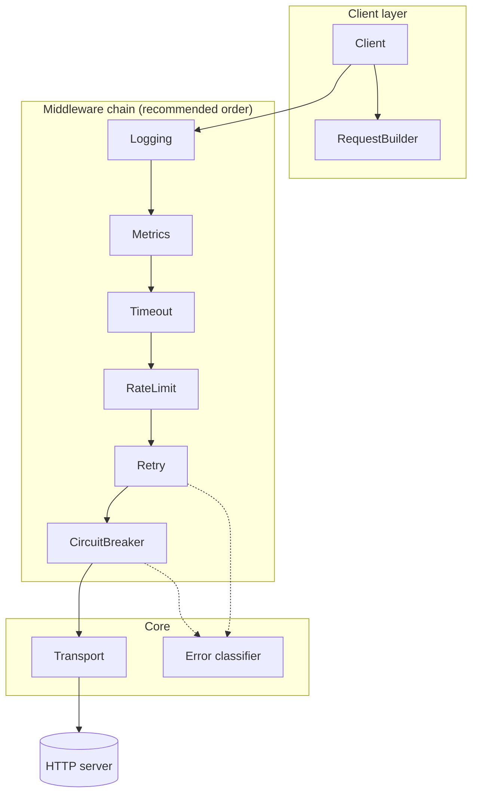

# Architecture

rhttp is a thin composition layer over `net/http`: every capability is an
`http.RoundTripper` decorator, and the client is the function composition of the
middleware you choose.

## Key decisions

**Middleware over configuration.** Instead of a monolithic client with feature
flags, each concern is an independent `func(http.RoundTripper) http.RoundTripper`.
You pay only for what you compose, and anything that implements the standard
interface — including your own middleware — slots into the chain.

**Retry outside the breaker.** Every retry attempt consults the circuit. When the
breaker trips mid-sequence, `ErrCircuitOpen` (non-retryable) cuts the remaining
attempts instead of queueing useless probes against a dead host.

**Invalid config falls back, and says so.** A middleware given an invalid
configuration returns the next RoundTripper unchanged. Construction never fails,
and misconfiguration degrades to "feature off" rather than a broken client — but
a protection that is absent in silence is discovered during the incident it was
meant to prevent, so the fallback is announced through
[`OnInvalidConfig`](../observability/diagnostics.md).

**Error classification, not sentinel matching.** Errors are classified into kinds
(`ErrKindTimeout`, `ErrKindDNS`, `ErrKindDNSNotFound`, `ErrKindConnection`,
`ErrKindTLS`, `ErrKindCanceled`, plus `ErrKindCircuitOpen` and
`ErrKindRateLimited` for the client's own refusals) that drive the retry and
failure predicates. The kind carries the retry verdict, so a permanent failure
such as NXDOMAIN is separated from its transient counterpart at classification
time rather than patched into the retry predicate. Classification costs ~8ns
with zero allocations.

**The caller's request is never mutated.** `Do` clones the request before it
enters the chain; middleware operate on the clone. The `http.RoundTripper`
contract is honored end to end.

## Performance discipline

Every hot-path component has an allocation budget enforced by benchmarks: backoff
strategies and error classification are zero-alloc, token acquire is ~50ns, and
the full six-middleware chain costs 12 allocs per request against the 4 of a bare
client. Regressions fail review — see [Benchmarks](benchmarks.md).
