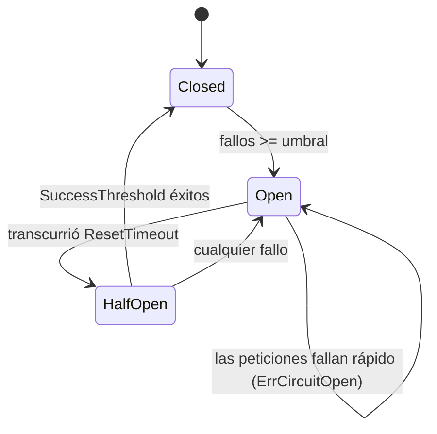

# Circuit breaker

## Configuración

```go
rhttp.CircuitBreaker(rhttp.CircuitBreakerConfig{
    FailureThreshold:    5,
    ResetTimeout:        30 * time.Second,
    MaxHalfOpenRequests: 1,
    SuccessThreshold:    1,
})
```

| Campo                 | Significado                                                                       |
| --------------------- | --------------------------------------------------------------------------------- |
| `FailureThreshold`    | Fallos consecutivos antes de que el circuito se abra                              |
| `ResetTimeout`        | Tiempo en estado Open antes de sondear (Half-Open)                                |
| `IsFailure`           | Predicado propio; por defecto: cualquier error o estado >= 500                    |
| `MaxHalfOpenRequests` | Sondas concurrentes permitidas en Half-Open (por defecto 1 — sonda única garantizada) |
| `SuccessThreshold`    | Sondas exitosas consecutivas necesarias para cerrar (por defecto 1)               |
| `OnStateChange`       | Callback invocado tras cada transición (por defecto: transiciones no observadas)  |

## Máquina de estados



Mientras está abierto, las peticiones fallan de inmediato con
`rhttp.ErrCircuitOpen` — no se hace ninguna llamada de red. `ErrCircuitOpen` no
es reintentable, así que cuando Retry envuelve al breaker un circuito abierto
corta también los intentos restantes. `Classify` lo reporta como
`ErrKindCircuitOpen`, que es como un recolector de métricas situado por encima
del breaker distingue "el circuito rechazó esto" de un fallo real de transporte.

## Observar las transiciones

Usa `OnStateChange`; no hagas polling de `State()`:

```go
rhttp.CircuitBreaker(rhttp.CircuitBreakerConfig{
    FailureThreshold: 5,
    ResetTimeout:     30 * time.Second,
    OnStateChange: func(from, to rhttp.CircuitState) {
        log.Printf("circuito %s -> %s", from, to)
    },
})
```

Con el `SuccessThreshold` por defecto de 1, la fase Half-Open se entra y se
abandona dentro de un mismo `RoundTrip`, así que **ninguna frecuencia de muestreo
puede capturarla**: quien hace polling ve `closed → open → closed` y la
recuperación en sí —la parte que te dice si la dependencia volvió por su cuenta—
es invisible por construcción. El callback reporta en lugar de muestrear, de modo
que una transición de nanosegundos igual aparece.

El callback se ejecuta en la goroutine de la petición que causó la transición,
con el mutex del breaker liberado, así que leer `State()` desde dentro es seguro.
No debe bloquear: la petición no puede avanzar hasta que retorne. Las transiciones
se publican en orden para un mismo flujo de peticiones; bajo concurrencia, dos
pueden publicarse en un orden distinto a aquel en que ocurrieron, precisamente
porque el mutex se libera antes.

## Control por generación

Cada transición de estado incrementa un contador de generación interno. Cada
petición admitida recuerda la generación bajo la que entró, y los resultados de
una generación obsoleta se descartan. Una petición lenta admitida en estado
Closed jamás puede corromper un episodio Half-Open posterior.

## Acceder al breaker

`CircuitBreaker(cfg)` crea un breaker por instancia del middleware y descarta el
manejador. Cuando necesitas la máquina de estados que acabas de configurar, usa
`CircuitBreakerWithState`:

```go
mw, breaker := rhttp.CircuitBreakerWithState(cfg)

client := rhttp.New(rhttp.WithMiddleware(mw))
_ = breaker.State() // Closed / Open / Half-Open
```

## Compartir un breaker entre clientes

Para que varios clientes se abran a la vez frente a la misma dependencia, crea el
breaker explícitamente y deriva middleware de él:

```go
cb := rhttp.NewCircuitBreaker(cfg)

clientA := rhttp.New(rhttp.WithMiddleware(cb.Middleware()))
clientB := rhttp.New(rhttp.WithMiddleware(cb.Middleware()))

fmt.Println(cb.State())
```

Todo el middleware derivado del mismo `SharedCircuitBreaker` observa un único
estado de circuito. Para publicar transiciones, sigue prefiriendo `OnStateChange`
antes que hacer polling de `State()`, por la razón de arriba.
