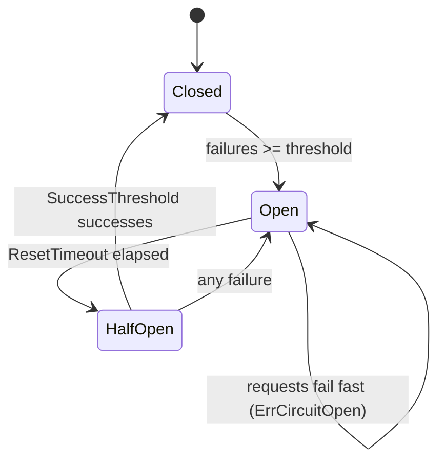

# Circuit breaker

## Configuration

```go
rhttp.CircuitBreaker(rhttp.CircuitBreakerConfig{
    FailureThreshold:    5,
    ResetTimeout:        30 * time.Second,
    MaxHalfOpenRequests: 1,
    SuccessThreshold:    1,
})
```

| Field                 | Meaning                                                                      |
| --------------------- | ---------------------------------------------------------------------------- |
| `FailureThreshold`    | Consecutive failures before the circuit opens                                |
| `ResetTimeout`        | Time in Open state before probing (Half-Open)                                |
| `IsFailure`           | Custom predicate; default: any error or status >= 500                        |
| `MaxHalfOpenRequests` | Concurrent probes allowed in Half-Open (default 1 — guaranteed single probe) |
| `SuccessThreshold`    | Consecutive successful probes required to close (default 1)                  |
| `OnStateChange`       | Callback invoked after every transition (default: transitions unobserved)     |

## State machine



While open, requests fail immediately with `rhttp.ErrCircuitOpen` — no network
call is made. `ErrCircuitOpen` is not retryable, so when Retry wraps the breaker
a tripped circuit also cuts the remaining retry attempts. `Classify` reports it
as `ErrKindCircuitOpen`, which is how a metrics recorder above the breaker tells
"the circuit refused this" apart from a genuine transport failure.

## Observing transitions

Use `OnStateChange` — do not poll `State()`:

```go
rhttp.CircuitBreaker(rhttp.CircuitBreakerConfig{
    FailureThreshold: 5,
    ResetTimeout:     30 * time.Second,
    OnStateChange: func(from, to rhttp.CircuitState) {
        log.Printf("circuit %s -> %s", from, to)
    },
})
```

At the default `SuccessThreshold` of 1 the Half-Open phase is entered and left
inside a single `RoundTrip`, so **no polling frequency can sample it**: a poller
sees `closed → open → closed` and the recovery itself — the part that tells you
whether the dependency came back on its own — is invisible by construction. The
callback reports rather than samples, so a transition lasting nanoseconds still
shows up.

The callback runs on the goroutine of the request that caused the transition,
with the breaker's mutex released, so reading `State()` from inside it is safe.
It must not block: the request cannot proceed until it returns. Transitions are
published in order for a single request stream; under concurrency two may be
published in an order different from the one in which they occurred, because the
mutex is released first.

## Generation gating

Every state transition bumps an internal generation counter. Each admitted request
remembers the generation it entered under, and results from a stale generation are
discarded. A slow request admitted while Closed can never corrupt a later
Half-Open episode.

## Reaching the breaker itself

`CircuitBreaker(cfg)` creates one breaker per middleware instance and discards
the handle. When you need the state machine you just configured, use
`CircuitBreakerWithState`:

```go
mw, breaker := rhttp.CircuitBreakerWithState(cfg)

client := rhttp.New(rhttp.WithMiddleware(mw))
_ = breaker.State() // Closed / Open / Half-Open
```

## Sharing a breaker across clients

To make several clients trip together against the same dependency, create the
breaker explicitly and derive middleware from it:

```go
cb := rhttp.NewCircuitBreaker(cfg)

clientA := rhttp.New(rhttp.WithMiddleware(cb.Middleware()))
clientB := rhttp.New(rhttp.WithMiddleware(cb.Middleware()))

fmt.Println(cb.State())
```

All middleware derived from the same `SharedCircuitBreaker` observe one circuit
state. For publishing transitions, still prefer `OnStateChange` over polling
`State()`, for the reason above.
